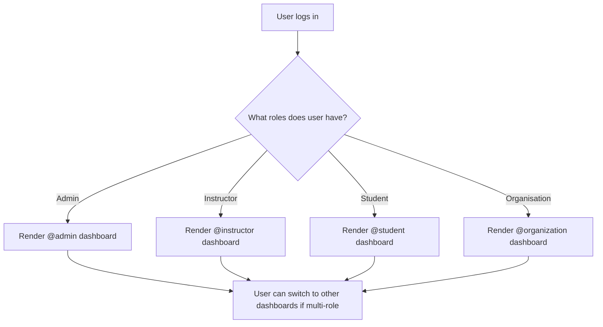
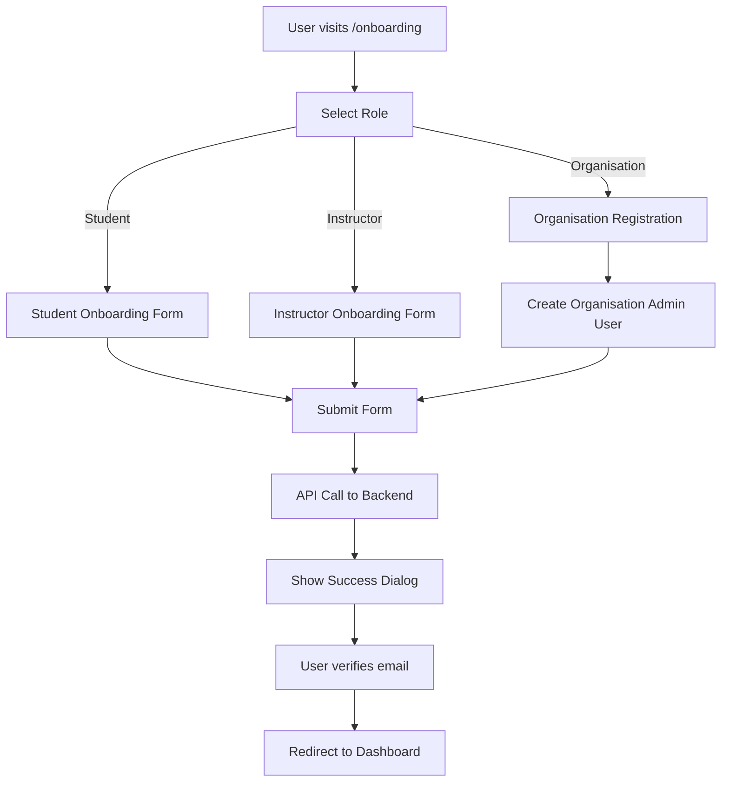
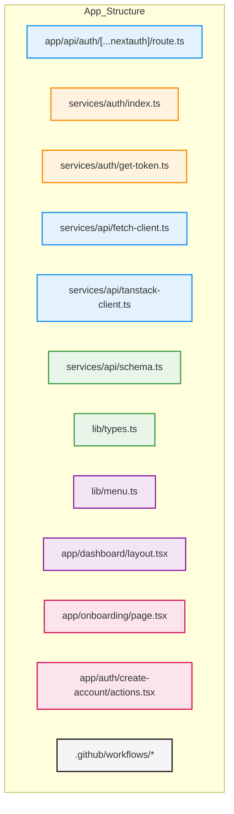
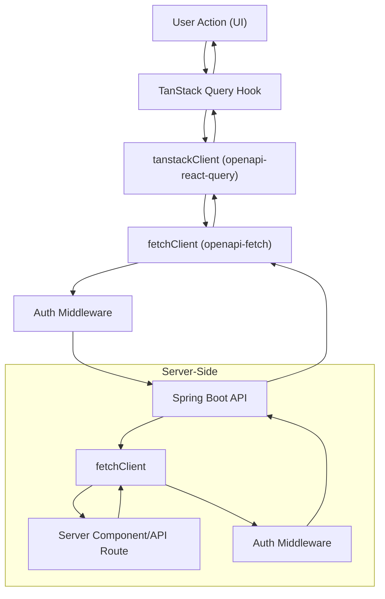

# Elimika UI Onboarding Guide


Welcome to the Elimika UI project! This comprehensive guide will help you understand the project structure, authentication, onboarding, dashboard flows, user roles, routing, and development/deployment workflows. Whether you're a new contributor or a stakeholder, you'll find everything you need to get started and contribute effectively.

---

## TL;DR: Quick Start

- **Framework:** Next.js (Turbopack, App Router, Parallel Routing)
- **Styling:** Tailwind CSS + shadcn/ui
- **State Management:** Zustand, TanStack Query
- **Authentication:** Auth v5 (NextAuth v5) with Keycloak
- **API Communication:** `openapi-fetch`, `openapi-react-query` (type-safe)
- **Type Generation:** `openapi-typescript` (syncs frontend types with backend OpenAPI spec)
- **User Roles:** Admin, Instructor, Student, Organisation User (multi-role support)
- **Parallel Routing:** Each user role has its own dashboard and navigation, rendered in parallel via Next.js App Router
- **Key Files:**
  - `package.json`, `next.config.ts`, `middleware.ts`
  - `app/api/auth/[...nextauth]/route.ts`, `services/auth/index.ts`, `services/auth/get-token.ts`
  - `services/api/fetch-client.ts`, `services/api/tanstack-client.ts`, `services/api/schema.ts`
  - `.github/workflows/` (CI/CD)
  - See [Project Structure](#project-structure) for a full tree

---

## Project Structure

```text
elimika-ui/
  app/
    api/
      auth/[...nextauth]/route.ts
    auth/
      create-account/
        _components/
        actions.tsx
        page.tsx
    dashboard/
      @admin/
        _components/
        instructors/
        organizations/
        overview/
        page.tsx
      @instructor/
        _components/
        assignments/
        classes/
        course-management/
        earnings/
        overview/
        profile/
        reviews/
        students/
        page.tsx
      @organization/
        _components/
        account/
        branches/
        classes/
        courses/
        instructors/
        overview/
        students/
        users/
        page.tsx
      @student/
        _components/
        certificates/
        grades/
        my-courses/
        my-schedule/
        overview/
        profile/
        page.tsx
      layout.tsx
    onboarding/
      _components/
      instructor/
      organisation/
      student/
      page.tsx
    page.tsx
  components/
  context/
  hooks/
  lib/
  public/
  services/
  store/
  types/
  .github/
  ...
```

- **@admin, @instructor, @organization, @student:** Parallel route segments for each user role's dashboard (see [Parallel Routing & User Roles](#parallel-routing--user-roles))
- **onboarding/**: All onboarding flows and forms
- **services/**: API clients, auth, and backend interaction
- **lib/**: Shared types, menu definitions, utilities
- **components/**: UI components (sidebar, nav, forms, etc.)
- **public/**: Static assets (e.g., Logo.svg)

---

## Parallel Routing & User Roles

### Parallel Routing in Next.js

Elimika UI uses **Next.js App Router's parallel routes** to render dashboards for different user roles/domains in parallel. This means:

- Each user role (admin, instructor, student, organisation user) has its own route segment under `app/dashboard/@role/`
- The main dashboard layout (`app/dashboard/layout.tsx`) determines which parallel route(s) to render based on the user's assigned domains
- Users with multiple roles can switch between dashboards without logging out

**Example:**

- An instructor who is also an admin will see both `@instructor` and `@admin` dashboards available
- The sidebar and navigation adapt to the current active domain

### User Roles & Capabilities

| Role             | Capabilities                                                             | Main Routes (Parallel)     |
| ---------------- | ------------------------------------------------------------------------ | -------------------------- |
| **Admin**        | System management, user/org approvals, analytics, settings               | `/dashboard/@admin`        |
| **Instructor**   | Course creation, class management, earnings, student management, profile | `/dashboard/@instructor`   |
| **Student**      | Course enrollment, grades, certificates, schedule, profile               | `/dashboard/@student`      |
| **Organisation** | Org management, branches, users, training centers, courses               | `/dashboard/@organization` |

#### Multi-Role Users

- Users can have multiple domains (e.g., instructor + admin)
- The dashboard layout (`app/dashboard/layout.tsx`) checks the user's domains and renders all relevant parallel routes
- Navigation and menu items are filtered by the active domain (see `lib/menu.ts`)

#### Example: Dashboard Layout Flow



---

## Onboarding Flow

The onboarding flow is designed to provide a tailored experience for each user role (Student, Instructor, Organisation User) and ensure that all necessary information is collected before a user accesses their dashboard. Here's how it works:

### Entry Point

- The onboarding process starts at [`app/onboarding/page.tsx`](app/onboarding/page.tsx).
- Users are presented with a choice of their primary role: **Student**, **Instructor**, or **Organisation**.
- Each role selection leads to a role-specific onboarding form and flow.

### Role-Specific Flows

- **Student:**
  - Fills out a student onboarding form (personal info, contact, etc.)
  - May be asked to provide additional details relevant to students
- **Instructor:**
  - Fills out an instructor onboarding form (personal info, professional details, qualifications)
  - May be prompted to add professional memberships, experience, and certifications
- **Organisation User:**
  - Registers a new training center/organisation (org details, address, domain, description)
  - Then creates the first admin user for the organisation

### Form Handling

- All forms use **React Hook Form** and **Zod** for validation and type safety
- Components are located in `app/onboarding/_components/` and `app/auth/create-account/_components/`
- Form submissions trigger backend API calls via actions in `app/auth/create-account/actions.tsx`
- File uploads (e.g., profile images) are supported

### Backend Interaction

- On form submission, data is sent to the backend via the API (see `createUser`, `createOrUpdateTrainingCenter` in actions.tsx)
- The backend responds with success/failure and any next steps (e.g., email verification)

### Post-Onboarding

- On successful onboarding, users see a success dialog with next steps (e.g., check email for verification, set password)
- After verification, users are redirected to their dashboard, which is determined by their role/domain
- The dashboard layout and navigation are then tailored to the user's assigned domain(s)

### Extensibility

- The onboarding flow is modular and can be extended to support new user roles or additional onboarding steps
- Shared form logic and validation schemas make it easy to maintain and update

**Diagram: Onboarding Flow (Vertical)**



---

## User Role Capabilities (Detailed)

### Admin

- Approve/reject instructors and organizations
- View analytics and system stats
- Manage all users and organizations
- Access all system settings
- See all pending tasks and recent activity

### Instructor

- Create and manage courses (drafts, published, preview)
- Manage classes and assignments
- Track earnings and payout history
- Manage student enrollments and reviews
- Complete and update professional profile

### Student

- Enroll in courses and view course content
- Track grades, certificates, and progress
- Manage schedule and profile
- View enrolled courses and upcoming classes

### Organisation User

- Register and manage organization profile
- Add/manage branches, users, and instructors
- Oversee courses and training centers
- Manage organization-level settings

---

## File Tree (Key Reusable Files)



- **Blue**: API/Backend interaction
- **Orange**: Authentication
- **Green**: Types
- **Purple**: Navigation
- **Pink**: Onboarding
- **Gray**: CI/CD

---

## Data Fetching: TanStack Query & Backend Interaction

### Overview

We use **TanStack Query** (React Query) for all client-side data fetching, caching, and mutations. For server-side data fetching (in Next.js server components or API routes), we use the same API clients directly, ensuring type safety and consistent logic.

#### Key Files:

- `services/api/fetch-client.ts`: Sets up the OpenAPI client with authentication middleware
- `services/api/tanstack-client.ts`: Wraps the fetch client for use with TanStack Query
- `services/api/schema.ts`: Auto-generated types from the backend OpenAPI spec
- `services/auth/get-token.ts`: Retrieves the current user's access token

### Client-Side Data Fetching (with TanStack Query)

- Use the `tanstackClient` to create hooks for queries and mutations
- Example: Fetching instructor profile

  ```ts
  import { useQuery } from "@tanstack/react-query"
  import { tanstackClient } from "@/services/api/tanstack-client"

  const { data, isLoading } = useQuery(["instructor", uuid], () =>
    tanstackClient.instructor.getInstructorByUuid({ uuid }),
  )
  ```

- Caching, refetching, and optimistic updates are handled automatically
- Mutations (e.g., updating a profile) use `useMutation` and invalidate relevant queries

### Server-Side Data Fetching

- Use the `fetchClient` directly in server components or API routes
- Example:

  ```ts
  import { fetchClient } from "@/services/api/fetch-client"

  export async function getServerSideProps(context) {
    const data = await fetchClient.instructor.getInstructorByUuid({
      uuid: context.params.uuid,
    })
    return { props: { data } }
  }
  ```

- The `getAuthToken` utility is used to attach the user's access token to requests
- Ensures SSR/SSG pages are hydrated with up-to-date data

### Data Fetching Flow Diagram (Vertical)



**Summary:**

- All data fetching (client and server) is type-safe and uses the same OpenAPI-generated clients
- TanStack Query is used for client-side caching, background refetching, and mutations
- Server-side fetching uses the same logic, ensuring consistency and type safety

---

## CI/CD & Workflows (`.github/workflows/`)

- **build-push.yaml**: Builds and pushes Docker images to GHCR on every push to `main`. Handles environment variable injection and secrets.
- **setup-server.yaml**: Transfers environment and Docker Compose files to the server after a successful build. Ensures the deployment directory is ready.
- **deploy.yml**: Deploys the latest Docker image to the self-hosted server using SSH. Pulls the new image, restarts containers, and confirms deployment.

**Secrets** are managed via GitHub Actions and injected at build/deploy time.

---

## Development Workflow

1. **Clone the repo:**
   ```bash
   git clone https://github.com/sarafrika/elimika-ui.git
   ```
2. **Install dependencies:**
   ```bash
   pnpm install
   ```
3. **Set up environment:**
   - Copy `env.example` to `.env.local` and fill in values (ask admin for secrets)
4. **Run locally:**
   ```bash
   pnpm dev
   # App runs at http://localhost:3000
   ```
5. **Type generation:**
   ```bash
   pnpm generate-types
   # Updates services/api/schema.ts from backend OpenAPI spec
   ```
6. **Lint/type-check:**
   ```bash
   pnpm lint
   pnpm type-check
   ```

---

## Questions & Support

- Check the code comments and this guide for most answers
- For backend API or type issues, re-run `pnpm generate-types`
- For authentication issues, check Keycloak config and Auth v5 setup
- For CI/CD or deployment, review `.github/workflows/` and ask Wilfred
- For UI/UX or onboarding, reach out to Alex
- For dashboard, navigation, or role logic, ask V1s1t0r (G@M!N3)

---

Happy coding and welcome to Elimika UI!
